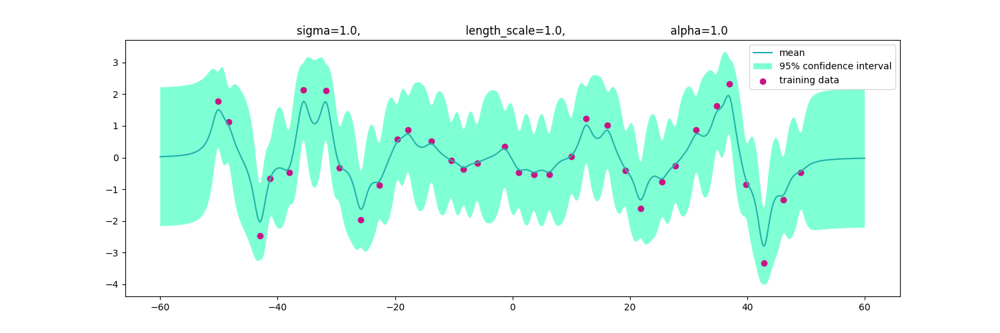
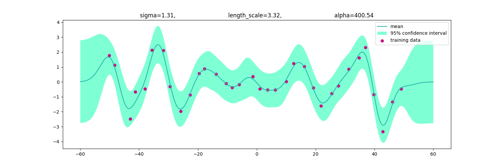

<center><h1>Machine Learning Homework 5</h1></center>    
<center><b>311554046 林愉修</b></center>  

## I. Gaussain Process  
### a. code with detailed explanations 
#### Part 1.
* Load Data
I defined a load_data function in dataloader.py.  
```python
# dataloader.py
def load_data(data_path):
    X = []
    y = []
    with open(os.path.join(data_path, 'input.data'), 'r') as f:
        for line in f.readlines():
            line = line.split()
            X.append(float(line[0]))
            y.append(float(line[1]))

    return np.array(X), np.array(y)
```
* Rational Quadratic Kernel  
Follow the formula referenced from [this website][1], I defined a rational_quadratic_kernel function in kernel.py.  
<div align="center">

</div>  

```python
# kernel.py
def rational_quadratic_kernel(x_a, x_b, **kernel_param):
    sigma = kernel_param.get('sigma', 1.0)
    length_scale = kernel_param.get('length_scale', 1.0)
    alpha = kernel_param.get('alpha', 1.0)
    SE = np.power(x_a.reshape(-1, 1) - x_b.reshape(1, -1), 2)

    return sigma**2 * np.power(1 + SE / (2 * alpha * length_scale**2), -alpha)
```

* Gaussian Process  
<div>

</div>  

I followed the three steps in the slides, and declare a class called GaussianProcess in GaussianProcess.py, you can choose whatever kernel you want as well as the kerenl parameter for the GaussianProcess.  
```python
# GaussianProcess.py
class GaussianProcess:
    def __init__(self, kernel_func, *, beta=5, **kernel_param):
        self.kernel_func = kernel_func
        self.kernel_param = kernel_param
        self.beta = beta
        self.X = None
        self.y = None
        self.C = None
        self.x_star = None
        self.mean = None
        self.var = None
        self.std = None
```

So the first step is to compute the covariance C, following formula in the slides, I defined a private member function called _covariance for the GaussianProcess class.    
```python
# GaussianProcess.py
def _covariance(self, X):
    return self.kernel_func(X, X, **self.kernel_param) + 1 / self.beta * np.identity(len(X))
```

Moreover, I defined a public member function called fit for the GaussianProcess class, which basically is computing the covariance for training data X.
```python
# GaussianProcess.py
def fit(self, X):
    self.X = X
    self.C = self._covariance(self.X)

    return self
```

Finally, I combined the three step meteioned above, calculating all the stuffs in the public member function called predict for the GaussianProcess class.
```python
# GaussianProcess.py
def predict(self, x_star, y):
    self.y = y
    self.x_star = x_star
    k_x_s = self.kernel_func(self.X, x_star, **self.kernel_param)
    k_star = self.kernel_func(x_star, x_star, **self.kernel_param) + 1 / self.beta * np.identity(len(x_star))
    temp = k_x_s.T @ np.linalg.inv(self.C)
    self.mean = temp @ self.y
    self.var = k_star - temp @ k_x_s
    self.std = np.sqrt(np.diag(self.var))

    return self.mean, self.var
```

* Visualization  
And for the visualization, I defined a public member function called visualization for the Gaussain Process class.  
```python
# GaussianProcess.py
def visualization(self, title, fig_path, fig_name='figure.png'):
    plt.figure(figsize=(15, 5))
    plt.plot(self.x_star, self.mean, color='lightseagreen', label='mean')
    plt.fill_between(self.x_star, self.mean + 2 * self.std, self.mean - 2 * self.std, facecolor='aquamarine', label='95% confidence interval')
    plt.scatter(self.X, self.y, color='mediumvioletred', label='training data')
    plt.legend(loc='upper right')
    plt.title(title)
    plt.savefig(os.path.join(fig_path, fig_name))
```

#### Part 2.  
* Optimize the kernel parameters  
Here we tried to optimize the kernel parameters by minimizing the negative log likelihood, I used the scipy.optimize.minimize to do so, where I defined a public member function called optimize_kernel_param for the GaussianProcess class.  
```python
# GaussianProcess.py
def optimize_kernel_param(self, X, y, *, bounds=None, **init_param):
    self.X = X
    self.y = y
    self.kernel_param = init_param
    const_args = (self.X, self.y, self.beta)
    x0 = tuple(init_param.values())

    res = minimize(self._objFunc(const_args), x0, bounds=bounds)
    for idx, key in enumerate(self.kernel_param.keys()):
        self.kernel_param[key] = res.x[idx]

    return self
```
* Negative Log Likelihood
I followed the formula given in the slides, and defined a private member function called _obj_func for the GaussianProcess class, which is a nested definition that wrapped the negLogLikelihood function inside.  
<div align="center">

</div>

```python
# GaussianProcess.py
def _objFunc(self, const_args):
    X, y, beta = const_args

    def negLogLikeLihood(x0):
        for idx, key in enumerate(self.kernel_param.keys()):
            self.kernel_param[key] = x0[idx]
        self.C = self._covariance(X)
        return 0.5 * np.log(np.linalg.det(self.C)) + 0.5 * y.T @ np.linalg.inv(self.C) @ y + len(X) / 2 * np.log(2 * np.pi)

    return negLogLikeLihood
```

### b. experiments settings and results  
#### Part 1.  
I use beta=5 and kernel parameters (sigma, length_scale, alpha) = (1, 1, 1).  
```python
# main.py
GP = GaussianProcess(rational_quadratic_kernel, beta=5)
mean, var = GP.fit(X_train).predict(X_test, y_train)
GP.visualization(title=f"sigma=1.0, \
                         length_scale=1.0, \
                         alpha=1.0", 
                 fig_path=args.fig_path, 
                 fig_name='original.png')
```
<div align="center">

</div>

#### Part 2.  
I use beta=5, and set the initial kernel parameters (sigma, length_scale, alpha) = (1, 1, 1), and found the optimal kernel parameters (1.31, 3.32, 400.54).
```python
# main.py
mean_opt, var_opt = GP.optimize_kernel_param(
                            X_train, 
                            y_train,
                            bounds=((1e-6, None), 
                                    (1e-6, None), 
                                    (1e-6, None)),
                            sigma=1, 
                            length_scale=1, 
                            alpha=1) \
                      .predict(X_test, y_train)
GP.visualization(
        title=f"sigma={GP.kernel_param['sigma']:.2f}, \
                length_scale={GP.kernel_param['length_scale']:.2f}, \
                alpha={GP.kernel_param['alpha']:.2f}",
        fig_path=args.fig_path,
        fig_name='optimized.png')
```

<div align="center">

</div>

### c. observations and discussion  
As the results shown in section b, by using the optimized kernel parameter, comparing to default kernel parameters, the predicted mean is less peaky and the predicted variance is smaller on every datapoint, thus the predicted line looks more smoother.  

## II. SVM 
### a. code with detailed explanations
#### Part 1.  

#### Part 2.  

#### Part 3.  

### b. experiments settings and results  
#### Part 1.  

#### Part 2.  

#### Part 3.  

### c. observations and discussion  


[1]: https://peterroelants.github.io/posts/gaussian-process-kernels/