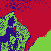
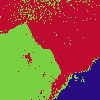
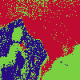
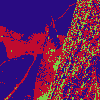
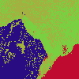
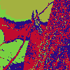
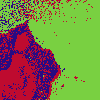
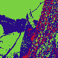
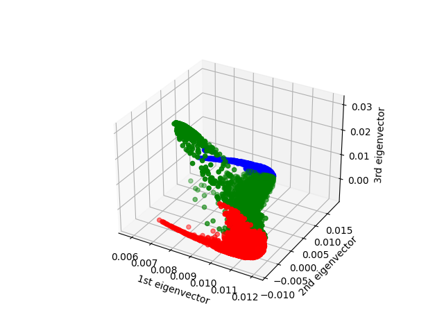
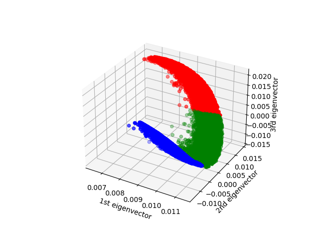

<center><h1>Machine Learning Homework 6</h1></center>    
<center><b>311554046 林愉修</b></center>  

## a. code with detailed explanations  
* Experiment 
For all the experiments from part 1 to part 4, I directly program it as below. One can change the setting (image, initialize method, kernel_parameters, etc.) by argparse.  
```python
# main.py
if __name__ == '__main__':
    args = parse_args()
    img, height, width = load_data(args.data_path)
    W = user_defined_kernel(img, width=width, 
                            gamma_s=args.gamma_s, 
                            gamma_c=args.gamma_c)

    print("kernel k means")
    kernel_k_means = Kmeans()
    for n_cluster in range(2, 5):
        print("-" * 40 + f"k = {n_cluster}" + "-" * 40)
        cluster_result, assigned_color = kernel_k_means.fit(
                                            W, n_cluster=n_cluster, 
                                            centroid_method=args.centroid_method, 
                                            EPS=args.EPS, visualize=True)
        visualization = assigned_color.reshape(-1, height, width, assigned_color.shape[-1])
        save_gif(visualization, gif_path=args.gif_path, 
                gif_name=f"kernel_kmeans_{args.centroid_method}_{n_cluster}.gif", 
                duration=2)


    print("unnormalized spectral clustering")
    unnormalized_SC = SpectralClustering(mode='unnormalized')
    for n_cluster in range(2, 5):
        print("-" * 40 + f"k = {n_cluster}" + "-" * 40)
        cluster_result, assigned_color = unnormalized_SC.fit(
                                            W, n_cluster=n_cluster, 
                                            centroid_method=args.centroid_method, 
                                            EPS=args.EPS, visualize=True)
        visualization = assigned_color.reshape(-1, height, width, assigned_color.shape[-1])
        save_gif(visualization, gif_path=args.gif_path, 
                gif_name=f"unnormalized_SC_{args.centroid_method}_{n_cluster}.gif", 
                duration=2)

        if n_cluster == 2:
            unnormalized_SC.plotEigenspaceLaplacian2D(
                            assigned_cluster=cluster_result, 
                            plot_path=args.plot_path, 
                            plot_name=f"unnormalized_SC_{args.centroid_method}_{n_cluster}.png")
        elif n_cluster == 3:
            unnormalized_SC.plotEigenspaceLaplacian3D(
                            assigned_cluster=cluster_result, 
                            plot_path=args.plot_path, 
                            plot_name=f"unnormalized_SC_{args.centroid_method}_{n_cluster}.png")
```
* Load Data  
I defined a function called load_data, which uses OpenCV to load the image, and covert it to 2D array.  
```python
# dataloader.py
def load_data(img_path):
    img = cv2.imread(img_path)
    height, width, channel = img.shape
    return img.reshape(-1, channel), height, width
```

* Kernel  
As the kernel function specified in the specification, I defined a function called user_defined_kernel.
```python
# kernel.py
def user_defined_kernel(img, *, width, **kernel_param):
    gamma_s = kernel_param.get('gamma_s', 0.001)
    gamma_c = kernel_param.get('gamma_c', 0.001)

    # Compute S (coordinate of the pixel)
    n = len(img)
    S = np.zeros((n, 2))
    for i in range(n):
        S[i] = [i // width, i % width]

    K = squareform(np.exp(-gamma_s * pdist(S, 'sqeuclidean'))) * \
        squareform(np.exp(-gamma_c * pdist(img, 'sqeuclidean')))

    return K
```

* K-means (usage)
I defined a class called Kmeans, which can be used to fit a given data to get the corresponding clustering result. Moreover, once the fitting is done, one can use it to evaluate other data and to get its corresponding clustering result.   
```python
# kmeans.py
class Kmeans:
    def __init__(self):
        np.random.seed(19990410)
        self.colormap = np.random.randint(0, 256, size=(100, 3))
        self.n_cluster = None
        self.centroid_method = None
        self.EPS = None


    def fit(self, X, n_cluster=2, centroid_method='kmeans++', EPS=1e-9, visualize=False):
        if len(X.shape) != 2:
            raise Exception ('Input shoud be a 2d matrix!')
        self.n_cluster = n_cluster
        self.centroid_method = centroid_method
        self.EPS = EPS

        print("starting k means")
        return self._kmeans(X, visualize=visualize)


    def evaluate(self, X_test):
        return self._E_step(self.centroids, X_test)
```

* Initialization method  
I choose two different ways to initialize the centroids, one is random and another is kmeans++.  
```python
# kmeans.py
class Kmeans:
    def _initialize_centroid(self, X):
        centroids = np.zeros((self.n_cluster, X.shape[1]))
        if self.centroid_method == 'kmeans++':
            # randomly pick one point as the first centroid
            centroids[0] = X[np.random.choice(range(len(X)), size=1), :]

            for c in range(1, self.n_cluster):
                temp_dist = np.zeros((len(X), c))
                # compute distance
                for j in range(c):
                    temp_dist[:, j] = self._euclidean(centroids[j], X)
                # for each data point, select the minimum distance (nearest centroid)
                dists = np.min(temp_dist, axis=1)
                # calulate probability
                dists /= np.sum(dists)
                # roulette wheel selection
                new_centroid_idx = np.random.choice(range(len(X)), size=1, p=dists)
                centroids[c] = X[new_centroid_idx]

        elif self.centroid_method == 'random':
            X_mean = np.mean(X, axis=0)
            X_std = np.std(X, axis=0)
            for c in range(X.shape[1]):
                centroids[:, c] = np.random.normal(X_mean[c], X_std[c], size=self.n_cluster)
        else:
            raise Exception ('unavailable centroid method!')

        return centroids
```

* K-means (algorithm)  
This whole algorithm can be divided into E-step and M-step. In E-step, we are going to use the given means to cluster every datapoint, while in M-step, we have to fixed the clustering result and to calculate the means for every cluster. The two step keep iterating until the means converged.    
In the function _kmeans below, which represent the whole K-means algorithm, it will stop the iteration once the sum of squared difference between two iterations is less than a given number.  
Also, this function not only return the final clustering result, but also the clustering result (which every cluster number is transformed to a corresponding color) in every iteration  for visualization.  
```python
# kmeans.py
class Kmeans:
    def _kmeans(self, X, visualize=True):
        print("initialize centroid")
        init_mean = self._initialize_centroid(X)
        assigned_cluster = np.zeros(len(X), dtype=np.uint8)
        assigned_color = []
        n_iter = 1
        print("start EM")
        while True:
            print("E step")
            # E step
            assigned_cluster = self._E_step(init_mean, X)

            print("M step")
            # M step
            new_mean = self._M_step(init_mean, assigned_cluster, X)

            diff = np.sum((new_mean - init_mean) ** 2)
            init_mean = new_mean
            if visualize:
                assign_color = self._cluster_color(assigned_cluster)
                assigned_color.append(assign_color)

            print(f"Iteration {n_iter}")
            for i in range(self.n_cluster):
                print(f"cluster={i+1} : (N pixel assigned : {np.count_nonzero(assigned_cluster == i)})")
            print(f"Difference : {diff}")
            print()

            n_iter += 1
            if diff < self.EPS:
                self.centroids = new_mean
                break

        if visualize:
            return assigned_cluster, np.array(assigned_color)

        return assigned_cluster


    def _E_step(self, mean, X):
    euclid_dist = np.zeros((len(X), self.n_cluster))
    for c in range(self.n_cluster):
        euclid_dist[:, c] = self._euclidean(mean[c], X)
    assigned_cluster = np.argmin(euclid_dist, axis=1)

    return assigned_cluster


    def _M_step(self, mean, assigned_cluster, X):
        new_mean = np.zeros(mean.shape)
        for i in range(self.n_cluster):
            assign_i = np.argwhere(assigned_cluster == i).reshape(-1)
            for j in assign_i:
                new_mean[i] += X[j]
            if len(assign_i) > 0:
                new_mean[i] /= len(assign_i)

        return new_mean
```

* Visualize the clustering process  
I use _cluster_color function to map the given clustering result to color result.  
```python
# kmeans.py
class Kmeans:
    def _cluster_color(self, assigned_cluster):
        color = self.colormap[:self.n_cluster, :]
        res = np.zeros((len(assigned_cluster), 3), dtype=np.uint8)
        for i in range(len(res)):
            res[i, :] = color[assigned_cluster[i]]

        return res
```
And the color result is then reshaped to images.  
```python
# main.py
visualization = assigned_color.reshape(-1, height, width, assigned_color.shape[-1])
```
I defined a save_gif function to save the above image as .gif file.  
```python
# utils.py
def save_gif(img_list, gif_path="./gif", gif_name="result.gif", duration=2):
    if not os.path.exists(gif_path):
        os.makedirs(gif_path)
    for img in img_list:
        img = img[:, :, ::-1]
    mimsave(os.path.join(gif_path, gif_name), img_list, 'GIF', duration=duration)
```

* Spectral Clustering  (usage)
I defined a class SpectralClustering, which is inherited from class Kmeans, and override the fit function of Kmeans.  One can choose which mode to use, unnormalized or normalized.  
```python
# spectral_clustering.py
class SpectralClustering(Kmeans):
    def __init__(self, *, mode='unnormalized'):
        super().__init__()
        self.mode = mode
        self.U = None


    def fit(self, X, n_cluster=2, centroid_method='kmeans++', EPS=1e-9, visualize=True):
        if len(X.shape) != 2 or X.shape[0] != X.shape[1]:
            raise Exception ('Input should be a similiarity matrix!')
        self.n_cluster = n_cluster
        self.centroid_method = centroid_method
        self.EPS = EPS

        return self._spectral_clustering(X, visualize=visualize)
```

* Spectal Clustering (algorithm)
As the algorithms in the slides, I defined a _spectral_clustering function to implement the algorithm, inside this function, I use _eigen_decomposition function to compute the graph Laplacian matrix, its eigenvalues and eigenvector (using np.linalg.eig) to get the U matrix (the eigenvectors sorted by eigenvalues in ascending order).  
```python
# spectral_clustering.py
class SpectralClustering(Kmeans):
    def _spectral_clustering(self, W, visualize=True):
        if self.U is None:
            self._eigen_decomposition(W)

        U = self.U[:, 1:self.n_cluster+1]

        if self.mode == 'normalized':
            sums = np.linalg.norm(U, axis=1).reshape(-1, 1)
            U = U / sums

        print("start k means")
        return self._kmeans(U, visualize=visualize)


    def _eigen_decomposition(self, W):
        D = np.diag(np.sum(W, axis=1))
        L = D - W

        print("eigen decomposition")
        if self.mode == 'unnormalized':
            eigenvalue, eigenvector = np.linalg.eig(L)
        elif self.mode == 'normalized':
            D_inverse_sqrt = np.diag(1 / np.diag(np.sqrt(D)))
            L_sym = D_inverse_sqrt @ L @ D_inverse_sqrt
            eigenvalue, eigenvector = np.linalg.eig(L_sym)

        sort_index = np.argsort(eigenvalue)
        self.U = eigenvector[:, sort_index]
```

* Visualize the eigenspace of graph Laplacian.  
I use matplotlib.pyplot to visualize, which using U matrix's first column as x coordinate, second column as y coordinate for k=2, and third column as z coordinate if k=3, additionally. Based on the clustering result, I assign each cluster its unique color.  
```python
# spectral_clustering.py
class SpectralClustering:
    def plotEigenspaceLaplacian3D(self, assigned_cluster, plot_path='./plot', plot_name='eigenspace3D.png'):
    if not os.path.exists(plot_path):
        os.makedirs(plot_path)

    ax = plt.figure().add_subplot(projection='3d')

    colors = ['r', 'g', 'b']
    x = self.U[:, 0]
    y = self.U[:, 1]
    z = self.U[:, 2]

    for c, i in zip(colors, np.arange(3)):
        ax.scatter(x[assigned_cluster==i], y[assigned_cluster==i], z[assigned_cluster==i], c=c)

    ax.set_xlabel('1st eigenvector')
    ax.set_ylabel('2nd eigenvector')
    ax.set_zlabel('3rd eigenvector')

    plt.savefig(os.path.join(plot_path, plot_name))


    def plotEigenspaceLaplacian2D(self, assigned_cluster, plot_path='./figure', plot_name='eigenspace2D.png'):
        if not os.path.exists(plot_path):
            os.makedirs(plot_path)

        fig = plt.figure()

        colors = ['r', 'g']
        x = self.U[:, 0]
        y = self.U[:, 1]

        for c, i in zip(colors, np.arange(2)):
            plt.scatter(x[assigned_cluster==i], y[assigned_cluster==i], c=c)

        plt.xlabel('1st eigenvector')
        plt.ylabel('2nd eigenvector')

        plt.savefig(os.path.join(plot_path, plot_name))
```

## b. experiments settings and results & discussions  
### Part 1.  
Initialization method: Kmean++  
Kernel parameter: $\gamma_{s}=0.00007$ , $\gamma_{c}=0.00007$  
Number of cluster: 2  
> The images below from left to right, show the original image, kernel kmeans clustering result, ratio cut spectral clustering result and normalized cut spectral clustering result, respectively.  

* image 1  
     
* image 2  
      

From the results above, we can cleary distinguish the clustering result for all methods.
For the execution time, kernel k means is much faster than spectral clustering since we need to perform eigen depcomposition on graph Laplacian matrix which increase the computational cost.  

### Part 2.  
The settings are the same as part 1 except for the number of cluster.  
#### Number of cluster: 3  
> The images below from left to right, show the original image, kernel kmeans clustering result, ratio cut spectral clustering result and normalized cut spectral clustering result, respectively.  
* image 1
   
* image 2 
   

For k=3, we can clearly distinguish the clustering result for kernel k means and ratio cut spectral clustering, while normalized cut spectral clustering has more sparse clustering result.  

#### Number of cluster: 4  
* image 1
   
* image 2
   

For k=4, all these methods have a similar clustering result, which is not very well partitioned.

### Part 3.  
Here, I try Random method, which sample from the normal distributions construct with respect to a certain channel to get a centroid coordinate.  
The settings are the same as part 2 except for the initialization method.  
Here I show the results with number of cluster is 3.  
> The images below from left to right, show the original image, kernel kmeans clustering result, ratio cut spectral clustering result and normalized cut spectral clustering result, respectively. 
* image 1  
    * Kmeans++
   
    * Random
   

* image 2  
    * Kmeans++
   
    * Random
   

Random method takes much more iterations to converge since the initialization is not that good, and k-means is very sensitive to initial centroid.
Althought it did not happen in the experiment, but bad initialization method may lead to one or many cluster has no point being assigned to it.  

### Part 4.  
#### number of cluster: 2
* image 1  
    * ratio cut  

    * normalized cut  


* image 2  
    * ratio cut  

    * normalized cut  


#### number of cluster: 3
* image 1
    * ratio cut  

    * normalized cut  


* image 2  
    * ration cut  

    * normalized cut  


As the results shown above, the pixel in different cluster seems to be well seperated in the eigenspace of graph Laplacian, that is, the pixels in the same cluster has similar coordinate in the eigenspace of graph Laplacian.  

## c. observations and dicussion
The kernel parameters (i.e. $\gamma_s$ and $\gamma_c$) has to set carefully, if $gamma_s$ is greater tahn $\gamma_c$, the clustering does not too detail, while if $gamma_s$ is way lower than $\gamma_c$, the result of clustering is too unclear. Moreover, when I set $\gamma_s = \gamma_c = 0.001$, and the result of kernel k means clustering is very terrible.  