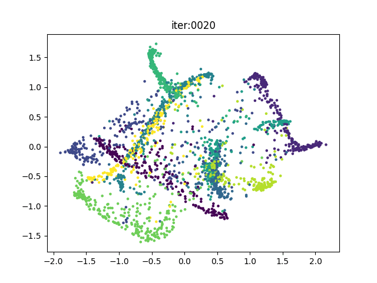
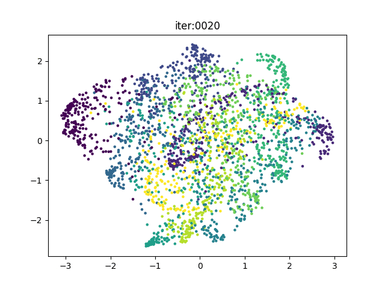
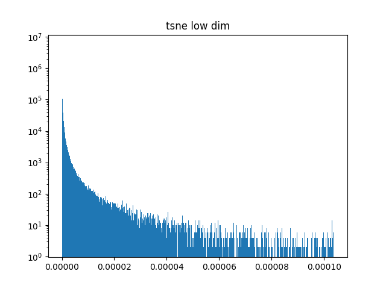
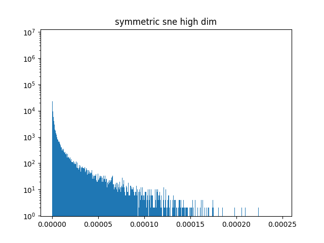
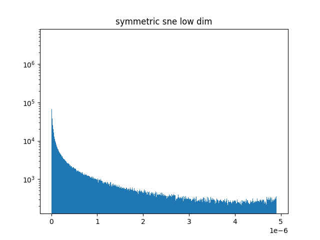
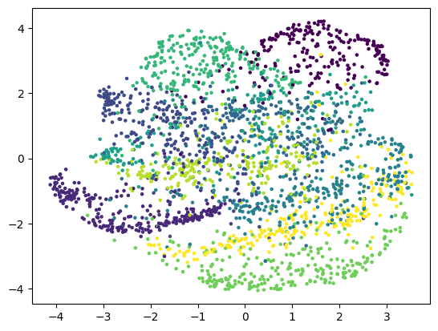

<center><h1>Machine Learning Homework 7</h1></center>    
<center><b>311554046 林愉修</b></center>  

## a. code with detailed explanations  
### Kernel Eigenfaces  
#### Part 1.  
* PCA  
I use SVD to solve the original eigen problem $Sw = \lambda w$, where $S = \frac{1}{N}\sum_x(x-\bar{x})(x-\bar{x})^T$.  
Steps:
    1. Compute centered training data $X_{centered}$.
    2. Use SVD to solve for the centered training data, $X_{centered} = U \times S \times V^T $.
    3. $V^T_{1...n}$ is what we want.

```python
def PCA(X, output_dim=2):
    X_mean = np.mean(X, axis=0)
    X_centered = X - X_mean
    U, S, VT = np.linalg.svd(X_centered, full_matrices=False, compute_uv=True)
    X_projected = U[:, :output_dim] * S[:output_dim]

    return X_projected, VT[:output_dim], X_mean
```

* LDA  
I follow the formula from the slides.  
Steps:
    1. Compute $S_W = \sum_{j=1}^{k}S_j$, where $S_j = \sum_{i \isin C_j}(x_i - m_j)(x_i - m_j)^T$ and $m_j = \frac{1}{n_j}\sum_{i \isin C_j}x_i$.
    2. Compute $S_B = \sum_{j=1}^{k}S_{B_j} = \sum_{j=1}^{k}n_j(m_j - m)(m_j - m)^T$ where $m = \frac{1}{n}\sum x$.
    3. Solve the eigen problem $S_W^{-1} S_B w = \lambda w$.
    4. The resulting $w^{1...n}$ is what we want.  

```python
def LDA(X, y, output_dim=2):
    n_feat = X.shape[1]
    n_class = len(np.unique(y))
    Sw = np.zeros((n_feat, n_feat))
    Sb = np.zeros((n_feat, n_feat))
    X_mean = np.mean(X, axis=0)

    for c in range(n_class):
        mask = (y == c+1)
        mean_c = np.mean(X[mask], axis=0)
        dw = X[mask] - mean_c
        Sw += dw.T @ dw
        db = (mean_c - X_mean).reshape(-1, 1)
        Sb += np.sum(mask) * db @ db.T
    
    A = np.linalg.pinv(Sw) @ Sb
    eigenvalue, eigenvector = np.linalg.eigh(A)
    W = eigenvector[:, ::-1]
    X_projected = X @ W[:, :output_dim]
    
    return X_projected, W[:, :output_dim].T, X_mean
```

* Eigenfaces
I directly take the eigenvectors corresponding to the top 25 largest eigenvalues from solving PCA.  
```python
X_train_projected_pca, X_eigenfaces, X_train_mean = PCA(X_train, output_dim=100)
fig, axes = plt.subplots(5, 5)
for idx, ax in enumerate(axes.flatten()):
    ax.imshow(X_eigenfaces[idx].reshape(H, W), cmap='gray')
```

* Fisherfaces  
I follow the steps from [Belhumeur, Hespanha and Kriegman](https://cseweb.ucsd.edu/classes/wi14/cse152-a/fisherface-pami97.pdf).  
First, I apply PCA to the data, and then apply LDA to the PCA-projected data. Take the eigenvectors corresponding to the top 25 largest eigenvalues from solving PCA and LDA $W_{opt} = W_{LDA}^TW_{PCA}^T$

```python
def fisherface(X, y, output_dim=2):
    n_feat = X.shape[1]
    n_class = len(np.unique(y))
    X_projected_pca, W_pca, _ = PCA(X, output_dim=n_feat-n_class)
    X_projected_lda, W_lda, _ = LDA(X_projected_pca, y, output_dim=output_dim)
    W_opt = W_lda @ W_pca

    return X_projected_lda, W_opt

X_train_projected_lda, X_fisherfaces = fisherface(X_train, y_train, output_dim=100)
fig, axes = plt.subplots(5, 5)
for idx, ax in enumerate(axes.flatten()):
    ax.imshow(X_fisherfaces[idx].reshape(H, W), cmap='gray')
```

* Reconstruction  
Use the eigenvectors $w$ we solved from PCA or LDA, multiply it to the projected data $X_{projected} = X_{centered}w$, so that $X_{reconstruct} = X_{projected}w^T$.  
```python
reconstruction_pca = X_train_projected_pca @ X_eigenfaces + X_train_mean
fig, axes = plt.subplots(2, 5)
for idx, ax in enumerate(axes.flatten()):
    ax.imshow(reconstruction_pca[random_idx[idx]].reshape(H, W), cmap='gray')

reconstruction_lda = X_train_projected_lda @ X_fisherfaces + X_train_mean
fig, axes = plt.subplots(2, 5)
for idx, ax in enumerate(axes.flatten()):
    ax.imshow(reconstruction_lda[random_idx[idx]].reshape(H, W), cmap='gray')
```

#### Part 2.  
* KNN  
Here is my implementation of k nearest neighbors, which use euclidean distance as criterion.  
```python
def KNN(X_test, X_train, y_test, y_train, k=5):
    dist = cdist(X_test, X_train, 'euclidean')
    sorted_index = np.argsort(dist, axis=1)
    k_nearest = sorted_index[:, :k]
    y_pred = np.zeros(len(X_test))

    for i in range(len(X_test)):
        unique, counts = np.unique(y_train[k_nearest[i]], return_counts=True)
        y_pred[i] = unique[np.argmax(counts)]
    
    acc = np.sum(y_pred == y_test) / len(y_test)
    
    return y_pred, acc
```

* Face Recognition  
To do face recognition, I first projected testing data to the space same as training data by the eigenfaces and fisherfaces, and then use KNN to classify testing data.  
```python
X_test_mean = np.mean(X_test, axis=0)
X_test_centered = X_test - X_test_mean
X_test_projected_pca = X_test_centered @ X_eigenfaces.T
y_pred_pca, acc = KNN(X_test_projected_pca, X_train_projected_pca, y_test, y_train, k=5)
print(acc)

X_test_projected_lda = X_test_centered @ X_fisherfaces.T
y_pred_lda, acc = KNN(X_test_projected_lda, X_train_projected_lda, y_test, y_train, k=5)
print(acc)
```

#### Part 3.  
* RBF kernel  
```python
def RBF_kernel(X, X_, gamma):
    return np.exp(-gamma * cdist(X, X_, 'sqeuclidean'))
```

* Polynomial kernel  
```python
def polynomial_kernel(X, X_, gamma, coef, degree):
    return np.power(gamma * X @ X_.T + coef, degree)
```

* Kernel PCA  
I follow the formula from the slides.  
For centering in high dimensional space, I follow trhe formula from [Sch¨olkopf, Smola and  M ¨uller](https://www.mlpack.org/papers/kpca.pdf)  
Steps:  
    1. Given similarity matrix K, compute $K_{centered} = K - 1_N K - K 1_N + 1_N K 1_N$, where $1_N = diag(1/N)$
    2.  Solve the eigen problem $K_{centered} w = \lambda w$
    3. $w^{1...n}$ is what we want.  

```python
def kernel_PCA(K, output_dim=2):
    oneN = np.diag(np.full(len(K), 1./len(K)))
    K_centered = K - oneN @ K - K @ oneN + oneN @ K @ oneN
    eigenvalue, eigenvector = np.linalg.eig(K_centered)
    a = eigenvector[:, np.argsort(eigenvalue)[::-1]]
    K_projected = K_centered @ a[:, :output_dim]

    return K_projected, a[:, :output_dim].T, K_centered
```

* Kernel LDA
I follow the formula from [Ghojogh, Karray and Crowley](https://arxiv.org/pdf/1906.09436.pdf). 
Steps:
    1. Compute $N = \sum_{j=1}^cK_jH_jK_j^T$, where $H_j = I - \frac{1}{n_j}11^T$.  
    2. Compute $M = \sum_{j=1}^cn_j(m_j - m_*)(m_j - m_*)^T$.  
    3. Solve the eigen problem $N^{-1}Mw = \lambda w$.  
    4. $w^{1...n}$ is what we want.  

```python
def kernel_LDA(K, y, output_dim=2):
    y_onehot = OneHotEncode(y)
    m_classes = y_onehot.T @ K / np.sum(y_onehot, axis=0)[:, np.newaxis]
    indices = y - 1
    N = K @ (K - m_classes[indices])
    # N += np.eye(len(K)) * 1e-8
    m_classes_centered = m_classes - np.mean(K, axis=1)
    M = m_classes_centered.T @ m_classes_centered
    A = np.linalg.pinv(N) @ M
    eigenvalue, eigenvector = np.linalg.eigh(A)
    a = eigenvector[:, ::-1]
    K_projected = K @ a[:, :output_dim]

    return K_projected, a[:, :output_dim].T
```

* Kernel Eigenfaces  
I directly take the eigenvectors corresponding to the top 25 largest eigenvalues from solving kernel PCA.   
```python
K_train_projected, X_kernel_eigenfaces, K_train_centered = kernel_PCA(K_train, output_dim=100)
```

* Kernel Fisherfaces  
Same as fisherfaces, first apply kernel PCA to training data and use kernel LDA to get the kernel fisherfaces.  $W_{opt} = W_{kLDA}^TW_{kPCA}^T$
```python
def kernel_fisherfaces(K, y, output_dim):
    n_feat = len(K)
    n_class = len(np.unique(y))
    K_projected_kpca, W_kpca, K_centered = kernel_PCA(K, output_dim=n_feat)
    K_projected_klda, W_klda = kernel_LDA(K_projected_kpca, y, output_dim=output_dim)
    W_opt = W_klda @ W_kpca
    
    return K_projected_klda, W_opt

K_train_projected_klda, X_kernel_fisherfaces, _ = LDA(K_train_projected, y_train, output_dim=100)
W_opt = X_kernel_fisherfaces @ X_kernel_eigenfaces
```

* Face Recognition 
Same as the non-kernel method, first projected similarity matrix of testing data to the spaces, and adopt KNN to classify.
```python
K_test_projected = K_test @ X_kernel_eigenfaces.T
y_pred_kpca, acc = KNN(K_test_projected, K_train_projected, y_test, y_train, k=5)
print(acc)

K_test_projected = K_test @ W_opt.T
y_pred_klda, acc = KNN(K_test_projected, K_train_projected, y_test, y_train, k=5)
print(acc)
```

### t-SNE  
#### Part 1.  
Here is how I modified the original tsne.py code to make it back to symmetric SNE, the commented code is the original t-SNE.  
The only 2 different between tsne and symmetric SNE are the Q matrix, which is the low dimensional pairwise affinities, and of course the gradient would be different.   
t-SNE:  
$q_{ij} = \frac{(1 + \lVert y_i - y_j \rVert^2)^{-1}}{\sum_{k \neq l}(1 + \lVert y_l - y_k \rVert^2)^{-1}}$
$\frac{\delta C}{\delta y_i} = 4 \sum_j(p_{ij} - q_{ij})(y_i - y_j)(1 + \lVert y_i - y_j \rVert^2)^{-1}$

Symmetric SNE:  
$q_{ij} = \frac{exp(-\lVert y_i - y_j \rVert^2)}{\sum_{k \neq l}exp(-\lVert y_l - y_k \rVert^2)}$
$\frac{\delta C}{\delta y_i} = 2 \sum_j(p_{ij} - q_{ij})(y_i - y_j)$

```python
# Compute pairwise affinities
sum_Y = np.sum(np.square(Y), 1)
num = -2. * np.dot(Y, Y.T)
# num = 1. / (1. + np.add(np.add(num, sum_Y).T, sum_Y))
num = np.exp(-np.add(np.add(num, sum_Y).T, sum_Y))
num[range(n), range(n)] = 0.
Q = num / np.sum(num)
Q = np.maximum(Q, 1e-12)

# Compute gradient
PQ = P - Q
for i in range(n):
    # dY[i, :] = np.sum(np.tile(PQ[:, i] * num[:, i], (no_dims, 1)).T * (Y[i, :] - Y), 0)
    dY[i, :] = np.sum(np.tile(PQ[:, i], (no_dims, 1)).T * (Y[i, :] - Y), 0)
```
#### Part 2.  
Every 20 iterations, I save the visualization of the 2D space, and use imagemagick to make all the pictures to gif.  
```python
if (iter + 1) % 20 == 0:
    pylab.title(f'iter:{iter+1:004}')
    pylab.scatter(Y[:, 0], Y[:, 1], 5, labels)
    pylab.savefig(f'./images/symmetric_sne/{iter+1:004}', dpi=100, facecolor='white')
    pylab.close()
```
```
$ convert -delay 10 images/symmetric_sne/*.png symmetric_sne.gif
```

#### Part 3.  
I defined a function called plot_similarity to visualize the distribution of pairwise similarities in both high dimensional space and low dimensional space, which is the P and Q matrix.  

```python
def plot_similarity(P, Q):
    pylab.title("symmetric sne high dim")
    pylab.hist(P.flatten(), bins=1000, log=True)
    pylab.savefig("symmetric_sne_high_dim", dpi=100, facecolor='white')
    pylab.close()

    pylab.title("symmetric sne low dim")
    pylab.hist(Q.flatten(), bins=1000, log=True)
    pylab.savefig("symmetric_sne_low_dim", dpi=100, facecolor='white')
    pylab.close()

plot_similarity(P, Q)
```

#### Part 4.  
I directly modified the last parameter of the tsne function.  

```python
Y, P, Q = tsne(X, labels, 2, 50, 5.0)
```

## b. experiments settings and results & discussions  
### Kernel Eigenfaces  
#### Part 1.  
* Original: 
    
* PCA:  
    Eigenfaces:  
    
    
    Reconstruction:
    

* LDA:
    Fisherfaces:
    

    Reconsturction:
    

#### Part 2.  
Both PCA and LDA project training data to 100-dim space, and k in KNN is choose to be 5.  
* PCA: 
    accuracy: 0.8667
* LDA:
    accuracy: 0.9667

#### Part 3.  
Both kernel PCA and kernel LDA project training data to 100-dim space, and k in KNN is choose to be 5.  
For RBF kernel, the gamma=0.01.  
For Polynomial kernel, gamma=0.01, coef0=1, degree=2.

* kernel PCA:  
    * RBF kernel: 
        accuracy: 0.8333 

    * Polynomial kernel: 
        accuracy: 0.7333
* kernel LDA:  
    * RBF kernel:  
        accuracy: 0.8333 

    * Polynomial kernel:  
        accuracy: 0.8

Comparing to non-kernel method, the performance of kernel PCA and kernel LDA are both worse than PCA and LDA. And LDA got the best results in this experiment settings.  

### t-SNE  
#### Part 1.  
* t-SNE
    The low dimension distribution of pairwise similarities follows Student's T distribution.  

* Symmetric SNE
    The low dimension ditribution of pairwise similarities follows Gaussian distribution.  

Since the Student's T distribution is a long-tail distribution compared to Gaussian distribution, it can solve the crowded problem that appears in Symmetric SNE.  (The distance between two points has to be larger to achieves the same probability).  

#### Part 2.  
* t-SNE: 
    gif: 
    
    
    last iteration: 
    

* Symmetric SNE:
    gif: 
    

    last ieteration: 
    

We can observe the  clustering result of Symmetric SNE is more crowded.  

#### Part 3.   
* t-SNE:
    High dimension: 
    

    Low dimension: 
    

* Symmetric SNE:  
    High dimension: 
    

    Low dimension:  
    
 
We can observe the range of x in low dimension distribution of Symmetric SNE is smaller than that of t-SNE, hence results in the  crowded problem.  

#### Part 4.  
* t-SNE:  
    perplexity=5
    

    perplexity=20
    

    perplexity=50
    

* Symmetric SNE:
    perplexity=5
    
    
    perplexity=20
    

    perplexity=50
    

We can observe that with higher perplexity, the overall structure is more obvious, however, it may be harder to distinguish between every clusters. With lower perplexity, only a few neighbors are influential, which may results in one group to be split into mutilple groups.  